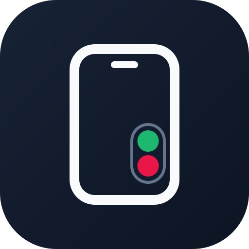

# Grip

**Answer or decline incoming calls from a compact control placed near the hand holding your phone.**

**ردّ على المكالمات أو ارفضها من لوحة صغيرة تظهر قرب اليد التي تمسك الهاتف.**

[Download Grip 0.7.7 Beta](https://github.com/SaeedAB22/Grip-Releases/releases/tag/v0.7.7) · [Report a problem](https://github.com/SaeedAB22/Grip-Releases/issues/new?template=bug_report.yml) · [Privacy](PRIVACY.md)

> [!IMPORTANT]
> Grip is currently in beta. Compatibility can vary by phone manufacturer, Android version, and the default Phone app.

## What Grip does | ماذا يفعل Grip؟

Grip works alongside your default Phone app. When a cellular call arrives, it uses on-device motion sensors and your calibration to estimate whether the phone is held in the right or left hand, then displays a compact answer/decline capsule on that side of the screen.

يعمل Grip بجانب تطبيق الاتصال الافتراضي. عند ورود مكالمة خلوية، يستخدم حساسات الحركة والمعايرة المحفوظة على جهازك لتقدير جهة اليد، ثم يعرض كبسولة الرد والرفض في الجهة الأقرب لإبهامك.

## Privacy | الخصوصية

- No Internet permission.
- No account, ads, analytics, or remote servers.
- Calibration and sensor processing stay on the device.
- Grip does not store your call history, contacts, phone numbers, or sensor readings.

- لا يطلب التطبيق صلاحية الإنترنت.
- لا حسابات، ولا إعلانات، ولا تحليلات، ولا خوادم خارجية.
- تتم المعايرة ومعالجة الحساسات محليًا على الجهاز.
- لا يخزن Grip سجل المكالمات أو جهات الاتصال أو أرقام الهواتف أو قراءات الحساسات.

See the full [Privacy Notice](PRIVACY.md).

## Requirements | المتطلبات

- Android 8.0 (API 26) or later.
- A cellular Phone app that exposes compatible call actions.
- Motion sensors are recommended; exact availability varies by device.
- Permissions for incoming-call detection, answering calls, notification access, and display over other apps.

## Install the beta | تثبيت النسخة التجريبية

1. Open the [Grip 0.7.7 Beta release](https://github.com/SaeedAB22/Grip-Releases/releases/tag/v0.7.7).
2. Download the APK listed under **Assets**.
3. Allow your browser or file manager to install apps from this source when Android asks.
4. Install Grip, open it, grant the requested permissions, and complete right/left-hand calibration.
5. Keep Google Play Protect enabled. Do not disable Android security scanning to install Grip.

> Android may show an additional warning because this beta is installed outside Google Play. Always download it from this repository and compare its SHA-256 value with the value published in the release notes.

## Permissions | الصلاحيات

| Permission | Why Grip needs it |
| --- | --- |
| Phone state | Detect an actual incoming cellular call. |
| Answer phone calls | Perform answer or decline when supported by Android and the device maker. |
| Notification access | Read compatible actions from the default Phone app's active call notification. |
| Display over other apps | Show the compact call capsule above the current screen. |

Grip does **not** request access to the camera, microphone, location, contacts, call log, storage, or Internet.

## Latest beta

**Grip 0.7.7 Beta** is the first public build signed with Grip's permanent release certificate.

- APK SHA-256: `996c6b3d0ff21f02fe09bb17052a1f15d7af0ead09ef4f5a8678cdee12c40e09`
- Signing certificate SHA-256: `8ad7f0a74fa47326920f80aa9c7bb95e052262528d6f0dd3a7b798bc576a406b`

If you installed an earlier development build, uninstall it once before installing 0.7.7 because the development certificate is different. Future GitHub releases will use the permanent certificate above and can update 0.7.7 directly.

## Known limitations

- Android does not provide a standard API that directly identifies which hand is holding the phone. Grip estimates it from calibrated motion patterns, so accuracy can vary with the device, case, posture, and movement.
- Answer/decline behavior can vary between Samsung, Google Pixel, Xiaomi, Oppo, and other manufacturers.
- Work profiles, Advanced Protection, organization policies, and restrictions on installing unknown apps can block APK installation.
- Grip currently targets cellular calls and intentionally excludes WhatsApp and other third-party VoIP notifications.

## Support

Found a problem? [Open a bug report](https://github.com/SaeedAB22/Grip-Releases/issues/new?template=bug_report.yml) and include the phone model, Android version, default Phone app, and the exact step that failed. Never post a phone number, caller name, screenshot containing personal call information, or other sensitive data.

## Source availability

Grip is currently closed-source. This repository is the official download, documentation, and issue-tracking page; it does not contain the application source code. See [NOTICE](NOTICE.md).
